# Redactify System Architecture & Security Specification

## 1. High-Level Architecture & Trust Boundary

```mermaid
flowchart TB
    subgraph ClientSandbox["Browser Memory Sandbox (Client Machine - 100% Offline)"]
        UserFile["User File (PDF / DOCX / Image / TXT)"]
        
        subgraph Ingestion["Document Ingestion Layer"]
            Dropzone["Dropzone & File Router"]
            PDFJS["PDF.js WASM Engine"]
            DOCXParser["JSZip XML Parser"]
            ImageCanvas["Canvas 2D Engine"]
        end

        subgraph CoreEngine["Master Detection Engine (<15ms)"]
            RegexEngine["International Regex Patterns"]
            MathValidators["Mathematical Checksum Validators\n(Luhn, Verhoeff, ISO 7064, Mod-11, Mod-23)"]
            ContextHeuristics["Contextual Heuristics Engine\n(Honorifics, Kinship, Signatures, Headers)"]
            Deduplicator["Spatial Deduplication & Conflict Resolver"]
        end

        subgraph OCREngine["Optional WASM OCR Pipeline (~15MB on-demand)"]
            TesseractWorker["Tesseract.js WebAssembly Worker"]
            BlockParser["Layout Blocks & Bounding Box Normalizer"]
        end

        subgraph StateLayer["Zustand Reactive State Stores"]
            DocStore["useDocumentStore"]
            RedactionStore["useRedactionStore (Normalized 0.0 - 1.0 Coordinates)"]
            LicenseStore["useLicenseStore (Feature Gating)"]
        end

        subgraph ExportLayer["Vector Burn-In & Serialization Engines"]
            PDFExporter["pdf-lib Vector Burn-In (Font removal + Opacity 1.0 Draw)"]
            DOCXExporter["JSZip XML Mutation Engine (DOM text node replacement)"]
            ImageExporter["Canvas Rasterized Export (Clean pixel replacement)"]
        end

        CleanDoc["Redacted Output File (Instant Browser Download)"]
    end

    subgraph ExternalCloud["Untrusted Internet / Cloud"]
        ThirdPartyCloud["Third-Party Servers / Cloud Providers\n(ZERO BYTES SENT - BLOCKED BY ARCHITECTURE)"]
    end

    UserFile --> Dropzone
    Dropzone --> PDFJS
    Dropzone --> DOCXParser
    Dropzone --> ImageCanvas

    PDFJS --> CoreEngine
    DOCXParser --> CoreEngine
    ImageCanvas --> OCREngine
    OCREngine --> CoreEngine

    CoreEngine --> StateLayer
    StateLayer --> ExportLayer
    ExportLayer --> CleanDoc

    ClientSandbox -.->|NO NETWORK CALLS| ThirdPartyCloud
```

---

## 2. Core Architectural Invariants

### Invariant 1: Zero Document Transmission
Under no circumstances are document raw bytes, extracted text tokens, OCR layouts, or redacted outputs transmitted across any network interface. All parsing, validation, and rendering is constrained to local browser execution context (V8 WebAssembly, Web Workers, HTML5 Canvas).

### Invariant 2: Normalized Coordinate System (0.0 to 1.0)
Screen resolutions, zoom factors, CSS viewports, and High-DPI canvas backings vary dramatically across devices. To guarantee pixel-perfect redaction across any zoom level:
normX = boxX / pageWidth
normY = (pageHeight - boxY - boxH) / pageHeight
All redaction coordinates stored in `useRedactionStore` are strictly normalized between 0.0 and 1.0. When exporting via `pdf-lib` or rendering via Canvas, coordinates are re-scaled against native document points, preventing spatial drift.

### Invariant 3: True Vector Text Removal vs Visual Masking
Naive PDF redaction tools simply overlay a black rectangle on top of text. In such flawed implementations, users can easily copy the underlying text or inspect the PDF stream.  
Redactify implements **True Vector Burn-In**:
1. Coordinates are calculated in PDF coordinate space.
2. Solid vector rectangles (`rgb(9/255, 9/255, 11/255)` with opacity 1.0) are hard-burned onto the PDF content stream.
3. For scanned images and photos, pixels within the bounding box are permanently overwritten in raw CanvasImageData buffers before compression.
4. For DOCX files, target XML text nodes (`<w:t>`) are replaced with sanitized replacement strings before re-zipping.

---

## 3. Excalidraw Architecture Spec (MCP Mapping)

When visualizing this architecture inside Excalidraw, the system maps to 4 primary functional swimlanes:
1. **Client Ingestion Zone** (Violet #8b5cf6): Dropzone, PDF.js legacy worker, JSZip XML parser.
2. **Mathematical Verification Zone** (Emerald #10b981): Luhn, Verhoeff, ISO 7064, Mod-11, Mod-23 validators.
3. **Reactive State & Canvas Zone** (Blue #3b82f6): Normalized coordinate bus, Crosshair drawing overlay, Zustand store.
4. **Vector Burn-In Zone** (Rose #f43f5e): pdf-lib vector drawing, JSZip DOM mutation, canvas blob generator.

---

## 4. Threat Model & Sandbox Analysis

| Threat Vector | Mitigation Strategy |
| :--- | :--- |
| **Data Interception in Transit** | **Nullified**: No network transmission occurs. Transport layer attack surface is 0. |
| **Memory Leaks Across Documents** | Explicit `URL.revokeObjectURL`, worker termination, and state reset on document clear. |
| **Malicious PDF / DOCX Payloads** | In-memory unzipping and parsing; script execution disabled in PDF.js worker. |
| **De-anonymization via PDF Inspection** | Vector burn-in with complete opacity and text stream scrubbing. |
| **Model Weight Poisoning** | Tesseract WASM is served from integrity-hashed official CDNs or local vendor assets. |
