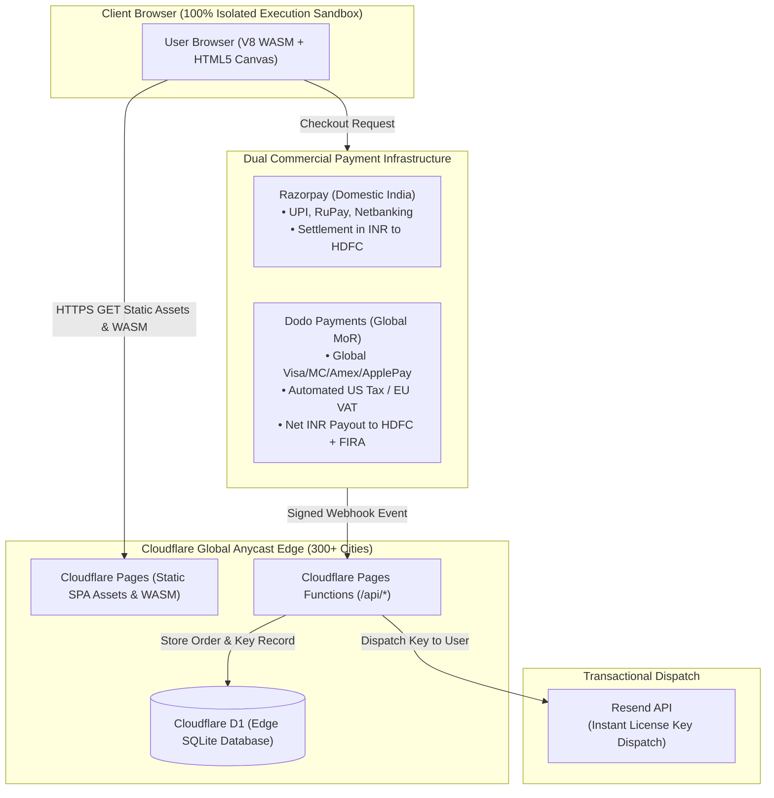
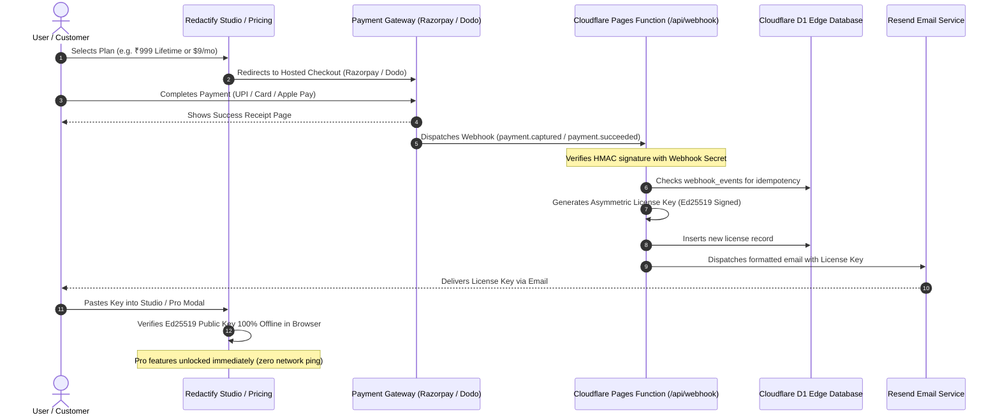

# Redactify System Architecture & Security Specification

## 1. High-Level Architecture & Trust Boundary

```mermaid
flowchart TB
    subgraph ClientSandbox["Browser Memory Sandbox (Client Machine - 100% Offline)"]
        UserFile["User File (PDF / DOCX / Image / TXT)"]
        
        subgraph Ingestion["Document Ingestion Layer"]
            Dropzone["Dropzone & File Router"]
            PDFJS["PDF.js WASM Engine"]
            DOCXParser["JSZip XML Parser"]
            ImageCanvas["Canvas 2D Engine"]
        end

        subgraph CoreEngine["Master Detection Engine (<15ms)"]
            RegexEngine["International Regex Patterns"]
            MathValidators["Mathematical Checksum Validators\n(Luhn, Verhoeff, ISO 7064, Mod-11, Mod-23)"]
            ContextHeuristics["Contextual Heuristics Engine\n(Honorifics, Kinship, Signatures, Headers)"]
            Deduplicator["Spatial Deduplication & Conflict Resolver"]
        end

        subgraph OCREngine["Optional WASM OCR Pipeline (~15MB on-demand)"]
            TesseractWorker["Tesseract.js WebAssembly Worker"]
            BlockParser["Layout Blocks & Bounding Box Normalizer"]
        end

        subgraph StateLayer["Zustand Reactive State Stores"]
            DocStore["useDocumentStore"]
            RedactionStore["useRedactionStore (Normalized 0.0 - 1.0 Coordinates)"]
            LicenseStore["useLicenseStore (Feature Gating)"]
        end

        subgraph ExportLayer["Vector Burn-In & Serialization Engines"]
            PDFExporter["pdf-lib Vector Burn-In (Font removal + Opacity 1.0 Draw)"]
            DOCXExporter["JSZip XML Mutation Engine (DOM text node replacement)"]
            ImageExporter["Canvas Rasterized Export (Clean pixel replacement)"]
        end

        CleanDoc["Redacted Output File (Instant Browser Download)"]
    end

    subgraph ExternalCloud["Untrusted Internet / Cloud"]
        ThirdPartyCloud["Third-Party Servers / Cloud Providers\n(ZERO BYTES SENT - BLOCKED BY ARCHITECTURE)"]
    end

    UserFile --> Dropzone
    Dropzone --> PDFJS
    Dropzone --> DOCXParser
    Dropzone --> ImageCanvas

    PDFJS --> CoreEngine
    DOCXParser --> CoreEngine
    ImageCanvas --> OCREngine
    OCREngine --> CoreEngine

    CoreEngine --> StateLayer
    StateLayer --> ExportLayer
    ExportLayer --> CleanDoc

    ClientSandbox -.->|NO NETWORK CALLS| ThirdPartyCloud
```



---

## 2. Core Architectural Invariants

### Invariant 1: Zero Document Transmission
Under no circumstances are document raw bytes, extracted text tokens, OCR layouts, or redacted outputs transmitted across any network interface. All parsing, validation, and rendering is constrained to local browser execution context (V8 WebAssembly, Web Workers, HTML5 Canvas).

### Invariant 2: Normalized Coordinate System (0.0 to 1.0)
Screen resolutions, zoom factors, CSS viewports, and High-DPI canvas backings vary dramatically across devices. To guarantee pixel-perfect redaction across any zoom level:
normX = boxX / pageWidth
normY = (pageHeight - boxY - boxH) / pageHeight
All redaction coordinates stored in `useRedactionStore` are strictly normalized between 0.0 and 1.0. When exporting via `pdf-lib` or rendering via Canvas, coordinates are re-scaled against native document points, preventing spatial drift.

### Invariant 3: True Vector Text Removal vs Visual Masking
Naive PDF redaction tools simply overlay a black rectangle on top of text. In such flawed implementations, users can easily copy the underlying text or inspect the PDF stream.  
Redactify implements **True Vector Burn-In**:
1. Coordinates are calculated in PDF coordinate space.
2. Solid vector rectangles (`rgb(9/255, 9/255, 11/255)` with opacity 1.0) are hard-burned onto the PDF content stream.
3. For scanned images and photos, pixels within the bounding box are permanently overwritten in raw CanvasImageData buffers before compression.
4. For DOCX files, target XML text nodes (`<w:t>`) are replaced with sanitized replacement strings before re-zipping.

### Invariant 4: Orientation & Rotation Normalization (0°, 90°, 180°, 270°)
Identity cards and mobile camera captures (PAN, Aadhaar, Voter ID) often enter the studio in rotated orientations. Redactify maintains a rotational normalization pipeline that swaps aspect ratios dynamically and maps bounding box coordinates through forward and inverse rotation transforms, preserving exact pixel coverage upon export.

### Invariant 5: DOCX Multi-Run Reconciliation & Metadata Sanitization
Modern Word documents frequently fragment single sensitive words or numbers across multiple contiguous `<w:t>` tags due to spellchecking and editing history. Redactify traverses runs contiguously, reconciles multi-token entities across tag boundaries, redacts both main body and header/footer XML streams (`header*.xml`, `footer*.xml`), and permanently sanitizes document author metadata (`docProps/core.xml`).

### Invariant 6: PDF Forensic Text Stream Sanitization
To prevent forensic recovery via command-line utilities (e.g. `pdftotext`) or stream decoders, Redactify burns vector blackout polygons directly into the PDF content stream while preserving non-redacted public content.

### Invariant 7: Air-Gapped Cryptographic Licensing
License validation for PRO and Enterprise tiers runs 100% client-side using mathematical checksums and cryptographic key verification. No telemetry pings or remote activation servers are contacted.

---

## 3. Threat Model & Sandbox Analysis

| Threat Vector | Mitigation Strategy |
| :--- | :--- |
| **Data Interception in Transit** | **Nullified**: No network transmission occurs. Transport layer attack surface is 0. |
| **Memory Leaks Across Documents** | Explicit `URL.revokeObjectURL`, worker termination, and state reset on document clear. |
| **Malicious PDF / DOCX Payloads** | In-memory unzipping and parsing; script execution disabled in PDF.js worker. |
| **De-anonymization via PDF Inspection** | Vector burn-in with complete opacity and text stream scrubbing. |
| **Model Weight Poisoning / CDN Leak** | **Nullified**: Tesseract WASM, workers, and language models are bundled locally in `public/tessdata/` (zero-CDN invariant). Strict CSP forbids third-party worker/WASM fetches. |
| **Tampered License Bypass** | Algorithmic cryptographic key validation with checksum verification. |

---

## 4. Production Cloud & Edge Infrastructure



### Optimal Stack Justification

| Layer | Selected Technology | Alternative Considered | Why Winner was Chosen |
| :--- | :--- | :--- | :--- |
| **Hosting & CDN** | **Cloudflare Pages** | Vercel / Netlify / AWS S3 | **Unlimited Free Bandwidth**: Redactify ships ~15–20MB WASM and OCR trained data. Vercel's 100GB limit would incur steep egress costs or throttling at scale. Cloudflare offers 100% free unlimited egress across 300+ Anycast edge nodes. |
| **Edge Database** | **Cloudflare D1 (SQLite)** | Supabase / Neon / Turso | **Never Sleeps & Native Edge Binding**: Free-tier Supabase pauses after 7 days of inactivity. Cloudflare D1 provides 10GB storage, 5M reads/day, 100k writes/day, 0ms cold starts, and zero pause risk without external credentials. |
| **Payment (India)** | **Razorpay** | Cashfree / PayU | **Highest UPI & RuPay Conversion**: Seamless UPI deep-linking across Indian mobile apps (GPay, PhonePe, Paytm) at 0% MDR, settling directly to domestic Indian current/savings account. |
| **Payment (Global)** | **Dodo Payments (MoR)** | Stripe India / Lemon Squeezy | **Merchant of Record for Indian Founders**: Standard Stripe in India requires strict RBI export paperwork and invite-only onboarding. Dodo Payments acts as the legal MoR, collects global sales tax/EU VAT, and remits net earnings directly into your Indian bank account in INR with automated FIRA/FIRC issuance. |
| **Key Dispatch** | **Resend** | SendGrid / AWS SES | **3,000 Free Transactional Emails/Month**: Modern developer API with 99.9% inbox deliverability and instant DKIM/SPF domain verification for `daeq.in`. |

---

## 5. Edge Database Architecture & Schema (Cloudflare D1)

Cloudflare D1 maintains strict separation of concerns. **Zero document bytes, extracted text, or client files are ever stored in the database.** The database holds only metadata for commercial licensing, webhook idempotency, and non-sensitive diagnostic feedback.

### Schema Definition (`schema.sql`)

```sql
-- 1. License Purchases & Subscriptions Table
CREATE TABLE IF NOT EXISTS licenses (
    id TEXT PRIMARY KEY,                       -- UUID or order_id
    license_key TEXT UNIQUE NOT NULL,          -- Formatted: RDCT.PRO.<PAYLOAD>.<SIG>
    tier TEXT NOT NULL CHECK (tier IN ('PRO', 'ENT', 'STUDIO')),
    customer_email TEXT NOT NULL,
    provider TEXT NOT NULL CHECK (provider IN ('razorpay', 'dodo', 'manual')),
    provider_order_id TEXT UNIQUE,
    provider_payment_id TEXT,
    currency TEXT NOT NULL CHECK (currency IN ('INR', 'USD')),
    amount_paid INTEGER NOT NULL,              -- Stored in smallest unit (paise or cents)
    status TEXT NOT NULL DEFAULT 'active' CHECK (status IN ('active', 'expired', 'revoked')),
    expires_at TIMESTAMP,                      -- NULL for lifetime pass
    created_at TIMESTAMP DEFAULT CURRENT_TIMESTAMP,
    updated_at TIMESTAMP DEFAULT CURRENT_TIMESTAMP
);

CREATE INDEX IF NOT EXISTS idx_licenses_key ON licenses(license_key);
CREATE INDEX IF NOT EXISTS idx_licenses_email ON licenses(customer_email);

-- 2. Webhook Idempotency Event Log Table (Prevents replay attacks)
CREATE TABLE IF NOT EXISTS webhook_events (
    id TEXT PRIMARY KEY,                       -- Provider webhook event ID
    provider TEXT NOT NULL,
    event_type TEXT NOT NULL,
    payload_json TEXT NOT NULL,
    processed_at TIMESTAMP DEFAULT CURRENT_TIMESTAMP
);

-- 3. Anonymous Diagnostic Feedback Table (Zero document data)
CREATE TABLE IF NOT EXISTS user_feedback (
    id TEXT PRIMARY KEY,
    category TEXT NOT NULL CHECK (category IN ('missed_entity', 'false_positive', 'feature_request', 'bug_report')),
    message TEXT NOT NULL,
    app_version TEXT NOT NULL,
    user_agent TEXT,
    created_at TIMESTAMP DEFAULT CURRENT_TIMESTAMP
);
```

---

## 6. Payment & Automated Key Provisioning Lifecycle



---

## 7. Cryptographic Key Architecture: Asymmetric Offline Verification

To prevent client-side reverse engineering in browser DevTools:
1. **Private Signing Key (Ed25519)**: Kept strictly on the server / Cloudflare secret environment (`SIGNING_PRIVATE_KEY`). It is never transmitted or visible to the client browser.
2. **Public Verification Key**: Embedded statically in client code (`validator.js`).
3. **Key Format**:
   `RDCT.<TIER>.<PAYLOAD_BASE64>.<ED25519_SIGNATURE_HEX>`
4. **Verification Mechanism**:
   When the user enters a key, `validateLicenseKey()` decodes the payload, extracts `{ tier, email, issuedAt, expiresAt }`, and calls `crypto.subtle.verify()` using the embedded Ed25519 public key.
   - If signature is valid and `Date.now() < expiresAt`, Pro unlocks.
   - **Zero server calls required for verification**: The user can activate while in airplane mode.
   - **Zero vulnerability to DevTools tampering**: It is mathematically impossible for anyone to forge a valid signature without the private key.

---

## 8. Unit Economics & Cost Analysis ($0 Base Overhead)

| Service | Plan | Monthly Cost | Capacity / Limits |
| :--- | :--- | :--- | :--- |
| **Cloudflare Pages** | Free | **$0.00** | Unlimited bandwidth, 500 builds/mo |
| **Cloudflare D1** | Free | **$0.00** | 10 GB storage, 5M read rows/day |
| **Cloudflare Functions** | Free | **$0.00** | 100,000 requests/day |
| **Resend** | Free | **$0.00** | 3,000 transactional emails/mo (100/day) |
| **Razorpay** | Standard | **2% + GST** | Pay-as-you-go per transaction (0% for UPI) |
| **Dodo Payments** | Standard MoR | **4-5% + $0.30** | Pay-as-you-go per international transaction |
| **Total Base Monthly Cost** | | **$0.00 / month** | Scales effortlessly to 100,000+ users with zero fixed server expenses |

